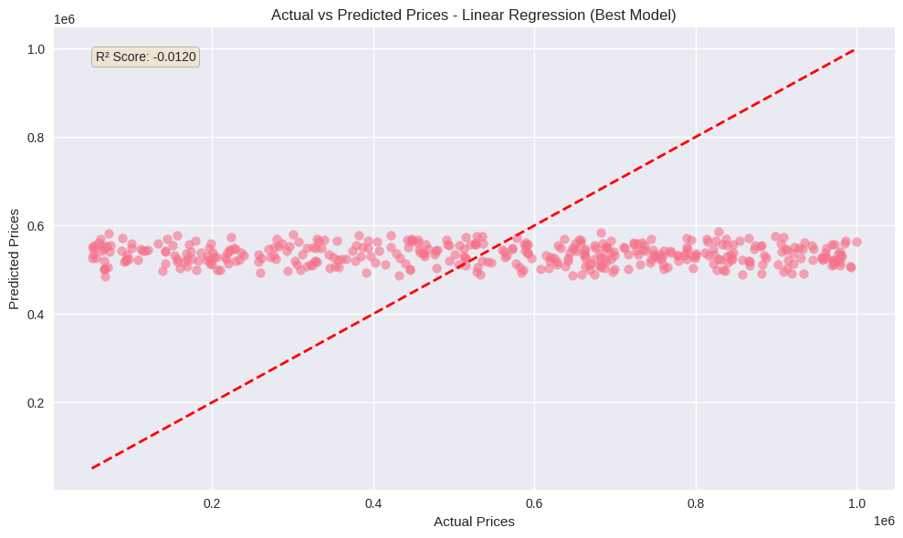
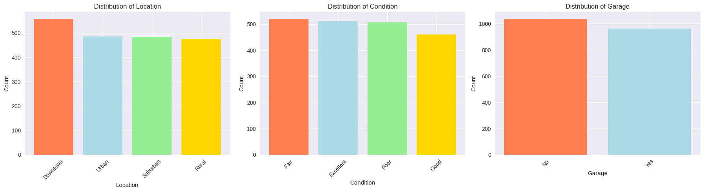
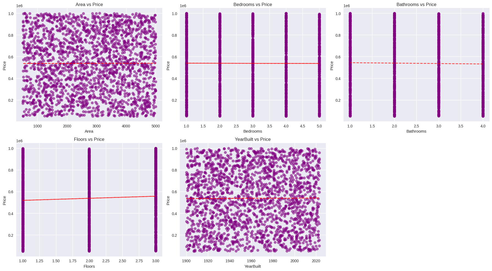

# 🏠 House Price Prediction – Machine Learning

## 📌 Problem Statement
Build a machine learning model to predict house prices based on different features such as area, bedrooms, location, and condition.

## 📊 Dataset
- Source: Kaggle
- Target Variable: Price
- Type: Regression Problem

## 🧪 Workflow
- Data Cleaning
- Exploratory Data Analysis (EDA)
- Feature Encoding & Scaling
- Model Training
- Model Evaluation

## 🤖 Models Used
- Linear Regression
- Random Forest Regressor

## 📈 Evaluation Metrics
- R² Score
- Mean Absolute Error (MAE)
- Mean Squared Error (MSE)

## 📊 Key Insights

## 🛠 Tech Stack
- Python
- Pandas, NumPy
- Scikit-learn
- Matplotlib, Seaborn
