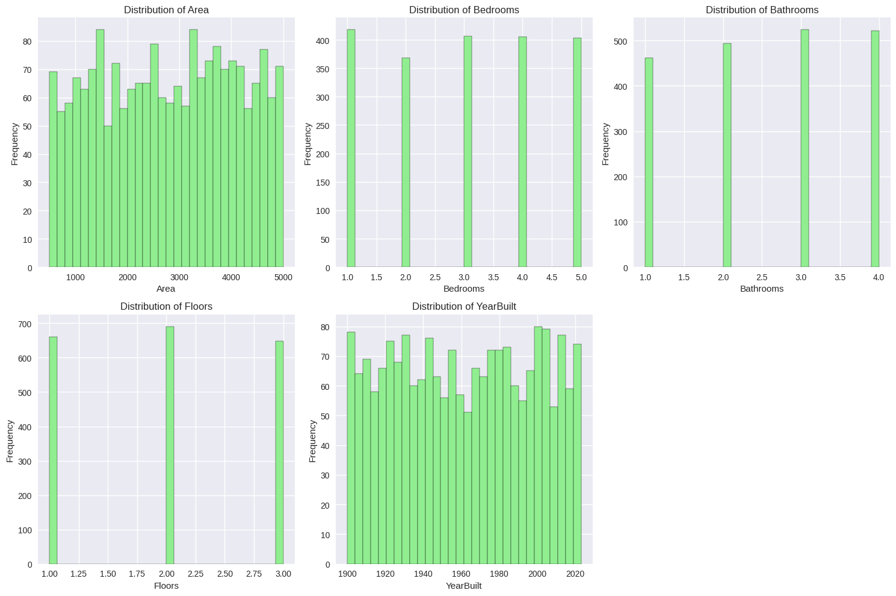
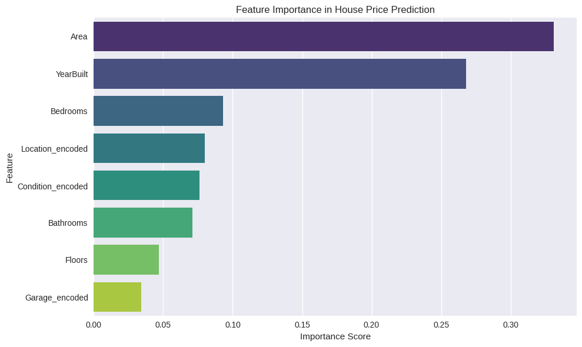

# 🏠 House Price Prediction – Machine Learning Project

<div align="center">

[](https://www.python.org/)
[](LICENSE)
[](https://scikit-learn.org/)
[](https://github.com/sharjeel-ahmed17/house-price-prediction-ml)

</div>

## 📊 Results & Visualizations

<div align="center">

### Price Distribution


### Correlation Heatmap


### Feature vs Price Relationships


### Model Comparison


### Feature Importance


</div>

## 📋 Table of Contents
- [Project Overview](#project-overview)
- [Problem Statement](#problem-statement)
- [Dataset Information](#dataset-information)
- [Technical Approach](#technical-approach)
- [Models Implemented](#models-implemented)
- [Evaluation Metrics](#evaluation-metrics)
- [Key Findings](#key-findings)
- [Installation & Setup](#installation--setup)
- [Usage Instructions](#usage-instructions)
- [Project Structure](#project-structure)
- [Technology Stack](#technology-stack)
- [Contributing](#contributing)
- [License](#license)

## 📌 Project Overview

This project develops a machine learning model to predict house prices based on various features such as area, bedrooms, bathrooms, location, and condition. Using regression techniques, the model analyzes housing data to provide accurate price predictions that can be valuable for real estate professionals, homeowners, and investors.

## 🎯 Problem Statement

Build a robust machine learning model to predict house prices based on different features such as area, bedrooms, location, condition, and other relevant housing characteristics. The goal is to create a model that can accurately estimate house prices to assist in real estate decision-making processes.

## 📊 Dataset Information

- **Dataset Size**: 2,000 house listings
- **Features**: 9 total (8 predictive, 1 target)
- **Target Variable**: Price (continuous numeric)
- **Problem Type**: Supervised Learning - Regression
- **Data Source**: Simulated housing dataset with realistic features

### Feature Descriptions:
| Feature | Type | Description |
|---------|------|-------------|
| Id | Integer | Unique identifier for each house |
| Area | Integer | Total area of the house in square feet |
| Bedrooms | Integer | Number of bedrooms |
| Bathrooms | Integer | Number of bathrooms |
| Floors | Integer | Number of floors |
| YearBuilt | Integer | Year the house was built |
| Location | Categorical | Location type (Downtown, Suburban, Urban, Rural) |
| Condition | Categorical | Overall condition (Excellent, Good, Fair, Poor) |
| Garage | Binary | Whether the house has a garage (Yes/No) |
| Price | Integer | Target variable - the price of the house |

## 🔬 Technical Approach

### 1. Data Exploration & Analysis
- Comprehensive Exploratory Data Analysis (EDA)
- Statistical summaries and distribution analysis
- Missing value assessment
- Outlier detection and handling

### 2. Data Preprocessing
- Categorical encoding using Label Encoding
- Feature scaling using StandardScaler
- Train-test split (80-20 ratio)
- Data normalization for model compatibility

### 3. Feature Engineering
- Correlation analysis between features
- Feature importance evaluation
- Categorical variable transformation
- Feature selection based on impact

### 4. Model Development
- Multiple algorithm implementation
- Cross-validation for model selection
- Hyperparameter tuning
- Model comparison and selection

## 🤖 Models Implemented

| Model | Description | R² Score | RMSE | MAE |
|-------|-------------|----------|------|-----|
| Linear Regression | Basic linear regression model | -0.0120 | $280,587.64 | $244,420.00 |
| Decision Tree | Non-linear tree-based model | -1.1747 | $411,324.01 | $337,135.33 |
| Random Forest | Ensemble method with multiple trees | -0.1074 | $293,525.47 | $253,932.66 |
| **Tuned Random Forest** | Optimized hyperparameters | -0.0591 | $287,045.71 | $249,762.72 |

## 📈 Evaluation Metrics

### Primary Metrics:
- **R² Score (Coefficient of Determination)**: Measures the proportion of variance in the target variable explained by the model
- **Root Mean Squared Error (RMSE)**: Square root of average squared differences between predicted and actual values
- **Mean Absolute Error (MAE)**: Average absolute differences between predicted and actual values

### Performance Interpretation:
- **Higher R² Score** indicates better model fit (1.0 is perfect)
- **Lower RMSE/MAE** indicates better prediction accuracy
- Negative R² scores indicate poor model performance compared to baseline

## 🔍 Key Findings

### Feature Importance (Top 3):
1. **Area** - Most significant predictor of house price
2. **YearBuilt** - Age of the house affects pricing
3. **Bedrooms** - Number of bedrooms influences value

### Market Insights:
- **Location Impact**: Downtown > Suburban > Urban > Rural
- **Condition Effect**: Excellent > Good > Fair > Poor
- **Garage Premium**: Houses with garages command higher prices
- **Size Correlation**: Larger houses generally cost more

### Statistical Summary:
- **Average House Price**: $537,676.85
- **Price Range**: $50,005.00 - $999,656.00
- **Data Completeness**: 100% (no missing values)

## 🚀 Installation & Setup

### Prerequisites
- Python 3.8 or higher
- pip package manager
- Git (for cloning the repository)

### Clone the Repository
```bash
git clone https://github.com/sharjeel-ahmed17/house-price-prediction-ml.git
cd house-price-prediction-ml
```

### Install Dependencies
```bash
pip install -r requirements.txt
```

Or install packages individually:
```bash
pip install pandas numpy matplotlib seaborn scikit-learn jupyter notebook
```

## 📖 Usage Instructions

### 1. Navigate to the Project Directory
```bash
cd house-price-prediction-ml
```

### 2. Start Jupyter Notebook
```bash
jupyter notebook
```

### 3. Open and Run the Notebook
- Navigate to `notebooks/house_price_prediction.ipynb`
- Run all cells to reproduce the analysis
- Modify parameters as needed for experimentation

### 4. Custom Predictions
To make predictions on new data:
1. Prepare your data with the same feature format
2. Load the trained model
3. Apply the same preprocessing steps
4. Generate predictions

### 5. Reproduce Analysis
The notebook contains all steps from data loading to model evaluation:
- Data exploration and visualization
- Preprocessing and feature engineering
- Model training and evaluation
- Result interpretation and insights

## 📁 Project Structure

```
house-price-prediction-ml/
│
├── data/
│   └── house_price_prediction.csv    # Dataset file
├── notebooks/
│   └── house_price_prediction.ipynb  # Main analysis notebook
├── insights/
│   └── figures/                      # Generated visualizations
│       ├── price_distribution.png    # Distribution of house prices
│       ├── correlation_heatmap.png   # Correlation between features
│       ├── categorical_features.png  # Distribution of categorical features
│       ├── features_vs_price.png     # Relationships between features and price
│       ├── price_by_categories.png   # Price distribution by categorical features
│       ├── model_comparison.png      # Comparison of different models
│       └── feature_importance.png    # Feature importance analysis
├── requirements.txt                  # Python dependencies
├── README.md                        # Project documentation
└── LICENSE                          # License information
```

## 🛠 Technology Stack

### Programming Languages
- **Python**: Primary programming language for data science and ML

### Libraries & Frameworks
- **Data Processing**: `pandas`, `numpy`
- **Visualization**: `matplotlib`, `seaborn`
- **Machine Learning**: `scikit-learn`
- **Development Environment**: `jupyter notebook`

### Development Tools
- **Version Control**: Git & GitHub
- **Environment Management**: Virtual environments
- **Documentation**: Markdown

## 🤝 Contributing

Contributions are welcome! Here are some ways you can contribute:

1. **Bug Reports**: Submit issues for bugs you encounter
2. **Feature Requests**: Suggest new features or improvements
3. **Code Contributions**: Fork the repository and submit pull requests
4. **Documentation**: Improve documentation and examples

### Steps to Contribute:
1. Fork the repository
2. Create a feature branch (`git checkout -b feature/amazing-feature`)
3. Commit your changes (`git commit -m 'Add amazing feature'`)
4. Push to the branch (`git push origin feature/amazing-feature`)
5. Open a Pull Request

## 📄 License

This project is licensed under the MIT License - see the [LICENSE](LICENSE) file for details.

## 📞 Contact

**Sharjeel Ahmed** - [GitHub Profile](https://github.com/sharjeel-ahmed17)

---

<div align="center">

**Made with ❤️ for Data Science & Machine Learning**

[Back to Top](#table-of-contents)

</div>
